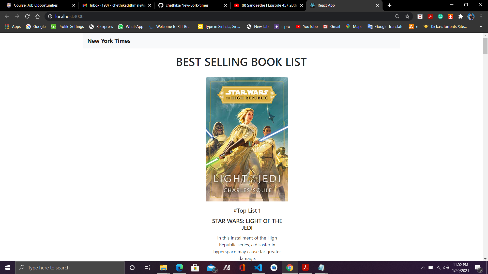
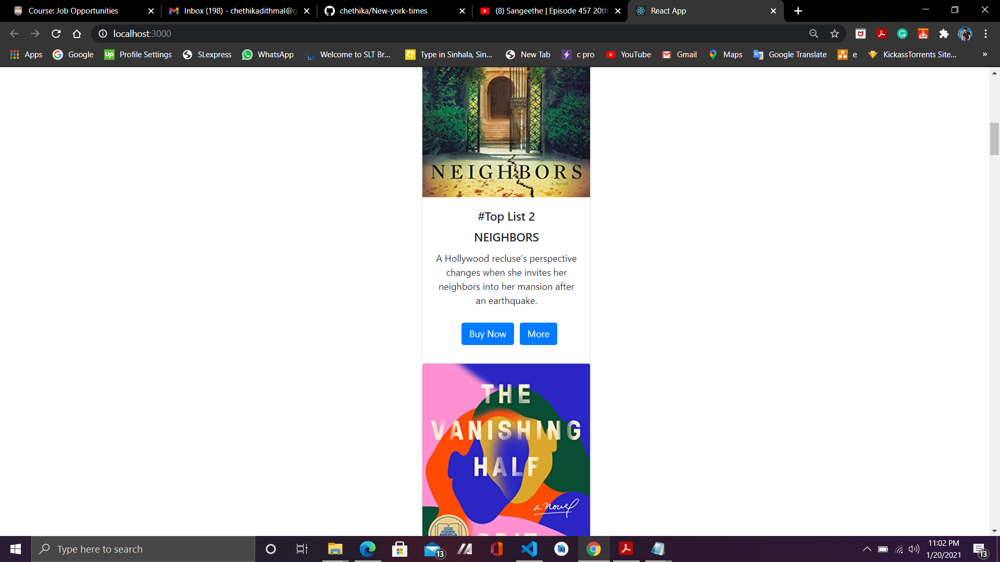
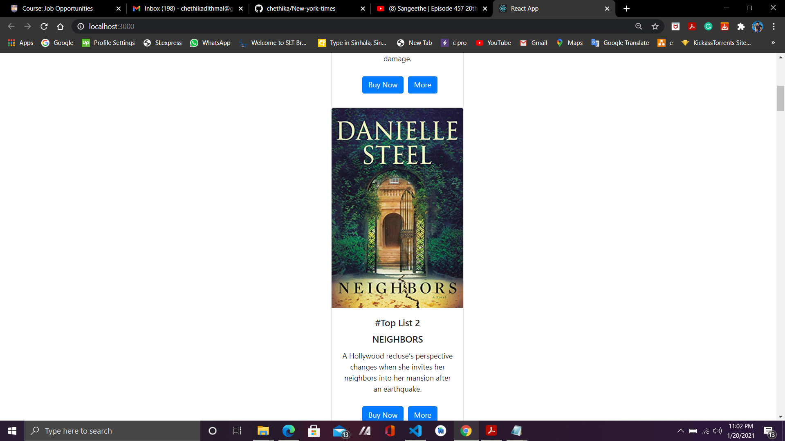

<h1>Question 02 - React-based Web Application</h1> 

 The task was to create web application to show the New York Times best-selling books list. 
 
 • For that, I have used the given API according to the given instructions. 
 
 • By using the web application which has been developed, the user can view the top sold book list. 
 
 • The web application is consisted with a nav bar with the title of the web application.
 
 • First, the web application loading the data and view the top sold book list and book list is displayed by using a card view. 
 
 • Each one is displayed the details of the book such as book title and description about the particular book. 
 
 • There are two buttons with every card. One is to purchase the books from Amazon and it has linked to the Amazon website and other button is to view the book details. 

 
 <h1>To Run the Web Application </h1>
 
 • Clone the project. 
 
 • Use “npm install” to install the all required dependencies. 
 
 • Use “npm start” to start the local server.
 
 • This web application uses “create-react-app”. 
 
 • The standard React's port 3000 is used to run this project. 
 
 • In the scripts section of package.json, you can configure the port. 
 
 • It is ideal for using API keys and other sensitive stuff because .env file can be ignored by the Git. 
 
 • For more info, refer the DOTENV and React documentation. 
 
 • Also, please delete the configuration variable from the package.json script segmentdotenv never overrides variables if they are already configured. 
 
 • The book API has used from the https://developer.nytimes.com/.
 
<h1> Home Pages </h1>
 

<h1> Buy Now </h1>

